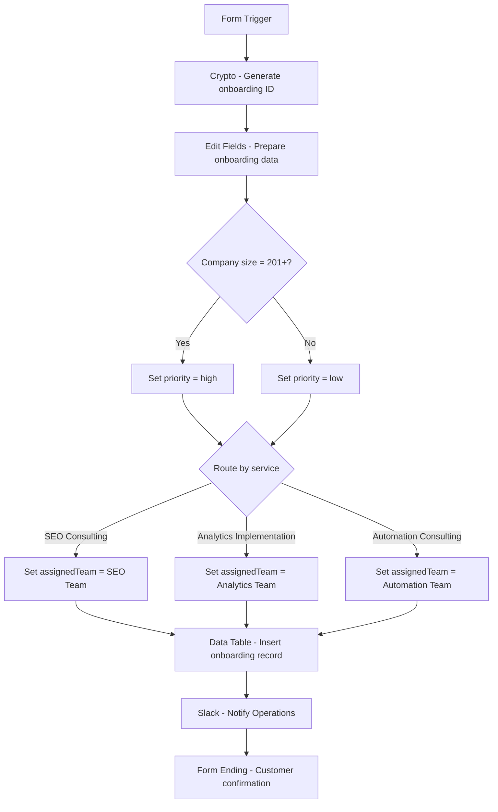

# Workflow Map

```mermaid
flowchart TD
    A[Form Trigger] --> B[Crypto - Generate onboarding ID]
    B --> C[Edit Fields - Prepare onboarding data]
    C --> D{Company size = 201+?}

    D -->|Yes| E[Set priority = high]
    D -->|No| F[Set priority = low]

    E --> G{Route by service}
    F --> G

    G -->|SEO Consulting| H[Set assignedTeam = SEO Team]
    G -->|Analytics Implementation| I[Set assignedTeam = Analytics Team]
    G -->|Automation Consulting| J[Set assignedTeam = Automation Team]

    H --> K[Data Table - Insert onboarding record]
    I --> K
    J --> K

    K --> L[Slack - Notify Operations]
    L --> M[Form Ending - Customer confirmation]
```
